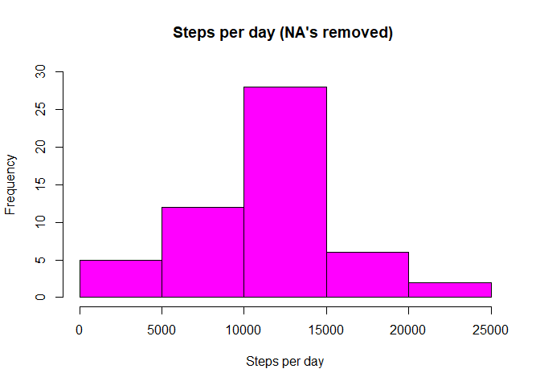
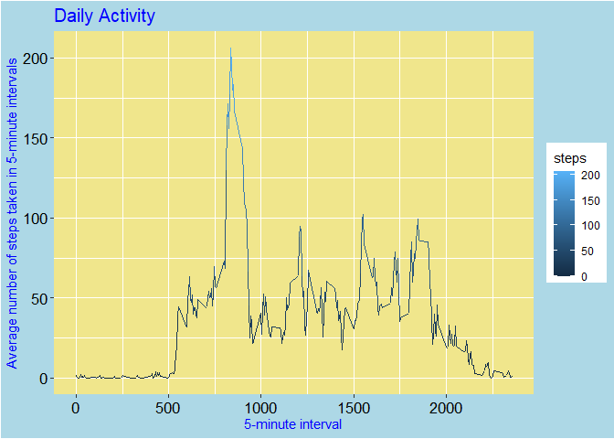

<<<<<<< HEAD
Introduction
------------

This assignment utilizes data from a personal activity monitoring
device. The device collected data at 5 minute intervals through out the
day, for two two months, dayly. The data were obtained from an anonymous
subject, and were collected in October and November of 2012. The data
include the number of steps taken by the subject in 5 minute intervals,
each day.

"The data for this assignment can be downloaded from the course web
site:<a href="https://d396qusza40orc.cloudfront.net/repdata%2Fdata%2Factivity.zip" class="uri">https://d396qusza40orc.cloudfront.net/repdata%2Fdata%2Factivity.zip</a>

Dataset: Activity monitoring data \[52K\] The variables included in this
dataset are:

steps: Number of steps taking in a 5-minute interval (missing values are
coded as NA) date: The date on which the measurement was taken in
YYYY-MM-DD format interval: Identifier for the 5-minute interval in
which measurement was taken The dataset is stored in a
comma-separated-value (CSV) file and there are a total of 17,568
observations in this dataset." (quoted from the text of the Assingmwent)

Loading and preprocessing the data
----------------------------------

    #Reading Data file:
    ProjectData<-read.csv("activity.csv", sep=",", header=TRUE, stringsAsFactors=TRUE)
    summary(ProjectData)

    ##      steps                date          interval     
    ##  Min.   :  0.00   2012-10-01:  288   Min.   :   0.0  
    ##  1st Qu.:  0.00   2012-10-02:  288   1st Qu.: 588.8  
    ##  Median :  0.00   2012-10-03:  288   Median :1177.5  
    ##  Mean   : 37.38   2012-10-04:  288   Mean   :1177.5  
    ##  3rd Qu.: 12.00   2012-10-05:  288   3rd Qu.:1766.2  
    ##  Max.   :806.00   2012-10-06:  288   Max.   :2355.0  
    ##  NA's   :2304     (Other)   :15840

What is mean total number of steps taken per day?
-------------------------------------------------

    DayStepsMean<- aggregate(steps~date,ProjectData, mean, na.rm=TRUE)
    summary(DayStepsMean)

    ##          date        steps        
    ##  2012-10-02: 1   Min.   : 0.1424  
    ##  2012-10-03: 1   1st Qu.:30.6979  
    ##  2012-10-04: 1   Median :37.3785  
    ##  2012-10-05: 1   Mean   :37.3826  
    ##  2012-10-06: 1   3rd Qu.:46.1597  
    ##  2012-10-07: 1   Max.   :73.5903  
    ##  (Other)   :47

Mean total number of steps taken per day (consistent with the summary
above):

    mean(DayStepsMean$steps)

    ## [1] 37.3826

37.3826
=======

Calculating the total number of steps taken per day:
====================================================

    ##Steps taking per day:
    DaySteps<- aggregate(steps~date,ProjectData, na.rm=T, sum)
    head(DaySteps,3)

    ##         date steps
    ## 1 2012-10-02   126
    ## 2 2012-10-03 11352
    ## 3 2012-10-04 12116

    summary(DaySteps)

    ##          date        steps      
    ##  2012-10-02: 1   Min.   :   41  
    ##  2012-10-03: 1   1st Qu.: 8841  
    ##  2012-10-04: 1   Median :10765  
    ##  2012-10-05: 1   Mean   :10766  
    ##  2012-10-06: 1   3rd Qu.:13294  
    ##  2012-10-07: 1   Max.   :21194  
    ##  (Other)   :47

Making a histogram of the total number of steps taken each day:
===============================================================

    hist(DaySteps$steps, main = "Steps per day (NA's removed) ", xlab = "Steps per day", ylab = "Frequency", ylim=c(0,30), col = "magenta")



    #dev.off()
    #ping("chunk5")
    #hist(DaySteps$steps, main = "Steps per day (NA's removed) ", xlab = "Steps per day", ylab = "Frequency", col = "magenta")
    #dev.off() 

Calculating and reporting the mean and median of the total number of steps taken per day:
=========================================================================================

Mean of the total number of steps taken per day:
================================================

    TotalDayStepsMean<-mean(DaySteps$steps,na.rm=TRUE)
    TotalDayStepsMean

    ## [1] 10766.19

10766.19
========

Median of the total number of steps taken per day:
==================================================

    TotalDayStepsMedian<-median(DaySteps$steps)
    TotalDayStepsMedian

    ## [1] 10765

10765
=====

What is the average daily activity pattern?
-------------------------------------------

Make a time series plot (i.e. type = “l”) of the 5-minute interval
(x-axis) and the average number of steps taken, averaged across all days
(y-axis)":

    library(ggplot2)
    DaylyActivity<- aggregate(steps~interval , ProjectData, mean)

    p<- ggplot(DaylyActivity, aes(interval,steps,color=steps))+ ggtitle("Dayly Activity")
    p + geom_line(size=.5)+labs(x = "5-minute interval")+labs(y = "Average number of steps taken in 5-minute intervals" ) +theme(axis.text=element_text(color="black",size=13))+theme(panel.background=element_rect(fill="khaki"))+theme(axis.title.x=element_text(color='blue',vjust=1.5),axis.title.y=element_text(color="blue",vjust=1.5), plot.title=element_text(color="blue",size=15,vjust=1),
    plot.background=element_rect(fill="lightblue")) 



    # plot(plotname)

Which 5-minute interval, on average across all the days in the dataset, contains the maximum number of steps?
=============================================================================================================

    maxStepsIndex <- which(DaylyActivity$steps == max(DaylyActivity$steps))
    maxNumberStepsInterval <-DaylyActivity$interval[maxStepsIndex]
    maxNumberStepsInterval

    ## [1] 835

835
===

Imputing missing values:
------------------------

Calculating and reporting the total number of missing values in the dataset (i.e. the total number of rows with NAs):
=====================================================================================================================

    summary(is.na(ProjectData))

    ##    steps            date          interval      
    ##  Mode :logical   Mode :logical   Mode :logical  
    ##  FALSE:15264     FALSE:17568     FALSE:17568    
    ##  TRUE :2304

\#There are 2304 NA’s in step variable, in initial dataset ProjectData,
and 0 NAs in date and 0 NA’s in interval columns

Devise a strategy for filling in all of the missing values in the dataset. The strategy does not need to be sophisticated:
==========================================================================================================================

To devise a strategy for filling missing values in the dataset the
article “Tutorial on 5 Powerful R Packages used for imputing missing
values” was
utilized:\[<a href="https://www.analyticsvidhya.com/blog/2016/03/tutorial-powerful-packages-imputing-missing-values/" class="uri">https://www.analyticsvidhya.com/blog/2016/03/tutorial-powerful-packages-imputing-missing-values/</a>\]

Hmisc package was used for bootstraping sample and predictive mean
matching to impute missing values.

missForest library was used to seed 10% missing values, with seed 81,to
make results reproducible:

    library(missForest)

    ## Loading required package: randomForest

    ## randomForest 4.6-14

    ## Type rfNews() to see new features/changes/bug fixes.

    ## 
    ## Attaching package: 'randomForest'

    ## The following object is masked from 'package:ggplot2':
    ## 
    ##     margin

    ## Loading required package: foreach

    ## Loading required package: itertools

    ## Loading required package: iterators

    library(Hmisc)

    ## Loading required package: lattice

    ## Loading required package: survival

    ## Loading required package: Formula

    ## 
    ## Attaching package: 'Hmisc'

    ## The following objects are masked from 'package:base':
    ## 
    ##     format.pval, units

    #Load Data
    #ProjectData
    #seed 10% missing values
    set.seed(81)
    ProjectData.mis<-prodNA(ProjectData, noNA =0.1)
    #impute steps with predictive mean matching values:
    ProjectData.mis$imputedSteps<- with(ProjectData.mis, impute(steps, mean))
    #after Imputing "steps" NA's with Hmisc(imputing with mean option):
    summary(is.na(ProjectData.mis))

    ##    steps            date          interval       imputedSteps   
    ##  Mode :logical   Mode :logical   Mode :logical   Mode :logical  
    ##  FALSE:13743     FALSE:15759     FALSE:15850     FALSE:17568    
    ##  TRUE :3825      TRUE :1809      TRUE :1718

There are now NA’s observed in ProjectData.mis “date” and “interbval”
columns, but no NA’s in “imputedSteps” column

As the task was to replace NAs, and in the initial dataset NA’s were
only in the “steps” column, and were completly imputed by mean (see
“ImputedSteps” column in ProjectData.mis), and considering “The strategy
does not need to be sophisticated”, the column “steps” of the initial
dataset Project Data (the only column that had NA’s ) was populated with
data from the column “imputedSteps”, from the ProjectData.mis by the
following operation:

    ProjectData$steps<-ProjectData.mis$imputedSteps
    #Which resulted in no NA's in the modified DataFrame ProjectData:
    summary(is.na(ProjectData))   

    ##    steps            date          interval      
    ##  Mode :logical   Mode :logical   Mode :logical  
    ##  FALSE:17568     FALSE:17568     FALSE:17568

The modidfied dataset ProjectData has now imputed column “steps”, and is
re-named, not to confuse it with original dataset ProjectData:

    ProjectDataImputed<-ProjectData 

Making a histogram of the total number of steps taken each day and Calculating and reporting the mean and median total number of steps taken per day:
=====================================================================================================================================================

    #Calculating steps taking per day with steps imputed by mean:
    DayStepsImputed<- aggregate(steps~date, ProjectDataImputed, sum)

    hist(DayStepsImputed$steps, main = "Total number of steps taken each day (with steps NAs inputed)", xlab = "Steps per day", ylab = "Frequency",  xlim=c(0,25000),ylim=c(0,35), col = "magenta")


Comparing two histograms, with steps NA’s removed and with steps NA’s
imputed:

    par(mfrow=c(2,1))
    hist(DaySteps$steps, main ="Total number of steps taken each day (NA's removed)" , xlab = "Steps per day", ylab = "Frequency", ylim=c(0,30), col = "magenta")
    hist(DayStepsImputed$steps, main ="Total number of steps taken each day (NAs imputed)", xlab = "Steps per day", ylab = "Frequency", xlim=c(0,25000), ylim=c(0,35), col = "magenta")


Calculating and reporting the mean and median total number of steps taken per day (with NA imputed):
====================================================================================================

    summary(DayStepsImputed$steps)

    ##    Min. 1st Qu.  Median    Mean 3rd Qu.    Max. 
    ##    1207    9418   10733   10733   12807   21279

mean total number of steps taken per day (with NA imputed):

    TotalDayStepsImputedMean<-mean(DayStepsImputed$steps)
    TotalDayStepsImputedMean

    ## [1] 10732.64

10732.64
========

median total number of steps taken per day (with NA imputed):

    TotalDayStepsImputedMedian<-median(DayStepsImputed$steps)
    TotalDayStepsImputedMedian

    ## [1] 10732.64

10732.64
========

Do these values differ from the estimates from the first part of the assignment? What is the impact of imputing missing data on the estimates of the total daily number of steps?
=================================================================================================================================================================================

Yes, there is a difference:both, mean and median have decrased after the
imputation of steps with mean, and the mean and median values after the
imputation has become equial:

              TotalDayStepsMean  = 10766.19 | TotalDayStepsMedian = 10765
        TotalDayStepsImputedMean = 10732.64 | TotalDayStepsImputedMedian = 10732.64 

Are there differences in activity patterns between weekdays and weekends?
-------------------------------------------------------------------------

Make a time series plot (i.e. type = “l”) of the 5-minute interval
(x-axis) and the average number of steps taken, averaged across all days
(y-axis)

    library(ggplot2)
    DaylyActivityImputed<- aggregate(steps~interval,ProjectDataImputed, mean)
    p<- ggplot(DaylyActivity, aes(  interval, steps,color=steps))+ ggtitle("Dayly Activity (with steps NA's imputed)")
    p + geom_line(size=.5)+labs(x = "5-minute interval")+labs(y = "Average number of steps taken" ) +theme(axis.text=element_text(color="black",size=13))+theme(panel.background=element_rect(fill="khaki"))+theme(axis.title.x=element_text(color='blue',vjust=1.5),axis.title.y=element_text(color="blue",vjust=1.5), plot.title=element_text(color="blue",size=15,vjust=1),
    plot.background=element_rect(fill="lightblue"))


Create a new factor variable in the dataset with two levels – “weekday” and “weekend” indicating whether a given date is a weekday or weekend day:
==================================================================================================================================================

    #Converting date variable to Date format  
    library(anytime)

    ProjectDataImputed$date<-anydate(ProjectDataImputed$date)
    head(ProjectDataImputed,3)

    ##     steps       date interval
    ## 1 37.2661 2012-10-01        0
    ## 2 37.2661 2012-10-01        5
    ## 3 37.2661 2012-10-01       10

    class(ProjectDataImputed$date)

    ## [1] "Date"

    #creating weekdays column 
    ProjectDataImputed$weekdays<-weekdays(ProjectDataImputed$date, abbreviate = FALSE) 
    head(ProjectDataImputed,3)

    ##     steps       date interval weekdays
    ## 1 37.2661 2012-10-01        0   Monday
    ## 2 37.2661 2012-10-01        5   Monday
    ## 3 37.2661 2012-10-01       10   Monday

    #Create a new factor variable in the dataset with two levels - "weekday" and "weekend" indicating whether a given date is a weekday or weekend day.
     
    #1 duplicating wekdays column as dayofweek column (for check later conversion to "Weekdays" and "Weekends")
    library(dplyr)

    ## 
    ## Attaching package: 'dplyr'

    ## The following objects are masked from 'package:Hmisc':
    ## 
    ##     src, summarize

    ## The following object is masked from 'package:randomForest':
    ## 
    ##     combine

    ## The following objects are masked from 'package:stats':
    ## 
    ##     filter, lag

    ## The following objects are masked from 'package:base':
    ## 
    ##     intersect, setdiff, setequal, union

    ProjectDataImputed<-mutate(ProjectDataImputed, dayofweek=weekdays) 
    head(ProjectDataImputed,3)

    ##     steps       date interval weekdays dayofweek
    ## 1 37.2661 2012-10-01        0   Monday    Monday
    ## 2 37.2661 2012-10-01        5   Monday    Monday
    ## 3 37.2661 2012-10-01       10   Monday    Monday

    #converting names of weekdays to "Weekday" or "Weekend"

    ProjectDataFinalImputed<-ProjectDataImputed%>%mutate(weekdays = case_when(
      weekdays == 'Sunday' ~ 'Weekend',
      weekdays == 'Saturday' ~ 'Weekend',
      TRUE ~ 'Weekday'))

    #Check conversion to Weekdays : 

    head(ProjectDataFinalImputed,3)

    ##     steps       date interval weekdays dayofweek
    ## 1 37.2661 2012-10-01        0  Weekday    Monday
    ## 2 37.2661 2012-10-01        5  Weekday    Monday
    ## 3 37.2661 2012-10-01       10  Weekday    Monday

Calculate avarage number of steps for weekdays:
===============================================

    DaylyActivityWeekdaysImputedFinal<- aggregate(steps~interval+weekdays, ProjectDataFinalImputed, mean)
    head(DaylyActivityWeekdaysImputedFinal,3)

    ##   interval weekdays     steps
    ## 1        0  Weekday 10.081355
    ## 2        5  Weekday  8.681355
    ## 3       10  Weekday 10.093182

    tail(DaylyActivityWeekdaysImputedFinal,3)

    ##     interval weekdays     steps
    ## 574     2345  Weekend  8.612394
    ## 575     2350  Weekend  4.658262
    ## 576     2355  Weekend 11.645656

Comparing weekdays and weekends activities:
-------------------------------------------

    g<-ggplot(DaylyActivityWeekdaysImputedFinal, aes(interval, steps, color=weekdays))+ ggtitle("Comparing Weekdays and Weekends activities")
    g + geom_line(size=.6)+ labs(x = "Time interval")+labs(y = "Avarage number of steps taken") +theme(axis.text=element_text(color="black",size=13))+theme(axis.title.x=element_text(color='blue',vjust=1.5), axis.title.y=element_text(color="blue",vjust=1.5))


Yes, there are differences in activity patterns between weekdays and weekends:
------------------------------------------------------------------------------

More steps, in general, are observed starting from about 1000s 5 minute
interval and untill the end of the day, during the weekends, compare to
the weekdays, while more steps are observed around 800s 5 mimute
interval, during the weekdays, compare to weekends.

Make a panel plot containing a time series plot (i.e. type = “l”) of the 5-minute interval (x-axis) and the average number of steps taken, averaged across all weekday days or weekend days (y-axis).
=====================================================================================================================================================================================================

    #plot(plotname)
    library(lattice)
    with(DaylyActivityWeekdaysImputedFinal, xyplot(steps ~ interval | weekdays, type="l", xlab = "Time interval", ylab = "Avarage number of steps taken", layout = c(1, 2)))


=======
---
title: 'Reproducible Research: Peer Assessment 1'
output:
  md_document: default
  html_document md_document: default
---
## Introduction

This assignment utilizes data from a personal activity monitoring device. The device collected data at 5 minute intervals through out the day, for two two months, dayly. The data were obtained from an anonymous subject, and were collected in October and November of 2012. The data include the number of steps taken by the subject in 5 minute intervals, each day.

"The data for this assignment can be downloaded from the course web site:https://d396qusza40orc.cloudfront.net/repdata%2Fdata%2Factivity.zip

Dataset: Activity monitoring data [52K]
The variables included in this dataset are:

steps: Number of steps taking in a 5-minute interval (missing values are coded as NA)
date: The date on which the measurement was taken in YYYY-MM-DD format
interval: Identifier for the 5-minute interval in which measurement was taken
The dataset is stored in a comma-separated-value (CSV) file and there are a total of 17,568 observations in this dataset."
(quoted from the text of the Assingmwent)

## Loading and preprocessing the data
 
```{r setup, include=FALSE}
knitr::opts_chunk$set(echo = TRUE)
```
```{r chunk1}
#Reading Data file:
ProjectData<-read.csv("activity.csv", sep=",", header=TRUE, stringsAsFactors=TRUE)
summary(ProjectData)

```


## What is mean total number of steps taken per day?

```{r chunk2}
DayStepsMean<- aggregate(steps~date,ProjectData, mean, na.rm=TRUE)
summary(DayStepsMean)
```
Mean total number of steps taken per day (consistent with the summary above):

``` {r chunk3}
mean(DayStepsMean$steps)
```
# 37.3826
 

 

# Calculating the total number of steps taken per day:
```{r chunk4}
##Steps taking per day:
DaySteps<- aggregate(steps~date,ProjectData, na.rm=T, sum)
head(DaySteps,3)
summary(DaySteps)
``` 

# Making a histogram of the total number of steps taken each day:
```{r chunk5.png, echo=TRUE}

hist(DaySteps$steps, main = "Steps per day (NA's removed) ", xlab = "Steps per day", ylab = "Frequency", ylim=c(0,30), col = "magenta")
#dev.off()
#ping("chunk5")
#hist(DaySteps$steps, main = "Steps per day (NA's removed) ", xlab = "Steps per day", ylab = "Frequency", col = "magenta")
#dev.off() 
```
 
# Calculating and reporting the mean and median of the total number of steps taken per day:

# Mean of the total number of steps taken per day:
```{r chunk6}
TotalDayStepsMean<-mean(DaySteps$steps,na.rm=TRUE)
TotalDayStepsMean
```
# 10766.19
 


# Median of the total number of steps taken per day:
```{r chunk7}
TotalDayStepsMedian<-median(DaySteps$steps)
TotalDayStepsMedian
```
# 10765
 

## What is the average daily activity pattern?

Make a time series plot (i.e. \color{red}{\verb|type = "l"|}type = "l") of the 5-minute interval (x-axis) and the average number of steps taken, averaged across all days (y-axis)":

```{r chunk8}
library(ggplot2)
DaylyActivity<- aggregate(steps~interval , ProjectData, mean)

p<- ggplot(DaylyActivity, aes(interval,steps,color=steps))+ ggtitle("Dayly Activity")
p + geom_line(size=.5)+labs(x = "5-minute interval")+labs(y = "Average number of steps taken in 5-minute intervals" ) +theme(axis.text=element_text(color="black",size=13))+theme(panel.background=element_rect(fill="khaki"))+theme(axis.title.x=element_text(color='blue',vjust=1.5),axis.title.y=element_text(color="blue",vjust=1.5), plot.title=element_text(color="blue",size=15,vjust=1),
plot.background=element_rect(fill="lightblue")) 


```
```{r  chunk9, echo=TRUE}
# plot(plotname)
```
# Which 5-minute interval, on average across all the days in the dataset, contains the maximum number of steps?

```{r chunk10,  echo=TRUE}
maxStepsIndex <- which(DaylyActivity$steps == max(DaylyActivity$steps))
maxNumberStepsInterval <-DaylyActivity$interval[maxStepsIndex]
maxNumberStepsInterval
```
# 835  


## Imputing missing values:

# Calculating and reporting the total number of missing values in the dataset (i.e. the total number of rows with NAs):

```{r chunk11, echo=TRUE}
summary(is.na(ProjectData))
```
#There are 2304 NA's in step variable, in initial dataset ProjectData, and 0 NAs in date and 0 NA's in interval columns


# Devise a strategy for filling in all of the missing values in the dataset. The strategy does not need to be sophisticated:

To devise a strategy for filling missing values in the dataset the article "Tutorial on 5 Powerful R Packages used for imputing missing values" was utilized:[https://www.analyticsvidhya.com/blog/2016/03/tutorial-powerful-packages-imputing-missing-values/]

Hmisc package was used for bootstraping sample and predictive mean matching to impute missing values.

missForest library was used to seed 10% missing values, with seed 81,to make results reproducible:

```{r chunk12,  echo=TRUE}
library(missForest)
library(Hmisc)
#Load Data
#ProjectData
#seed 10% missing values
set.seed(81)
ProjectData.mis<-prodNA(ProjectData, noNA =0.1)
#impute steps with predictive mean matching values:
ProjectData.mis$imputedSteps<- with(ProjectData.mis, impute(steps, mean))
#after Imputing "steps" NA's with Hmisc(imputing with mean option):
summary(is.na(ProjectData.mis))

```
There are now NA's observed in ProjectData.mis "date" and "interbval" columns, but no NA's in "imputedSteps" column

As the task was to replace NAs, and in the initial dataset NA's were only in the "steps" column, and were completly imputed by mean (see "ImputedSteps" column in ProjectData.mis), and considering "The strategy does not need to be sophisticated", the column "steps" of the initial dataset Project Data (the only column that had NA's ) was populated with data from the column "imputedSteps", from the ProjectData.mis by the following operation:

```{r chunk13, echo=TRUE }
ProjectData$steps<-ProjectData.mis$imputedSteps
#Which resulted in no NA's in the modified DataFrame ProjectData:
summary(is.na(ProjectData))   
```

The modidfied dataset ProjectData has now imputed column "steps", and is re-named, not to confuse it with original dataset ProjectData:
```{r chunk14, echo=TRUE}
ProjectDataImputed<-ProjectData 
```

# Making a histogram of the total number of steps taken each day and Calculating and reporting the mean and median total number of steps taken per day:

```{r chunk15, echo=TRUE}
#Calculating steps taking per day with steps imputed by mean:
DayStepsImputed<- aggregate(steps~date, ProjectDataImputed, sum)
```
```{r chunk16, echo=TRUE}
hist(DayStepsImputed$steps, main = "Total number of steps taken each day (with steps NAs inputed)", xlab = "Steps per day", ylab = "Frequency",  xlim=c(0,25000),ylim=c(0,35), col = "magenta")
 

```
 
 
Comparing two histograms, with steps NA's removed and with steps NA's imputed:
```{r chunk17, echo=TRUE}
par(mfrow=c(2,1))
hist(DaySteps$steps, main ="Total number of steps taken each day (NA's removed)" , xlab = "Steps per day", ylab = "Frequency", ylim=c(0,30), col = "magenta")
hist(DayStepsImputed$steps, main ="Total number of steps taken each day (NAs imputed)", xlab = "Steps per day", ylab = "Frequency", xlim=c(0,25000), ylim=c(0,35), col = "magenta")
```  


# Calculating and reporting the mean and median total number of steps taken per day (with NA imputed):
```{r chunk18, echo=TRUE}
summary(DayStepsImputed$steps)
```
 
 mean total number of steps taken per day (with NA imputed):
```{r chunk19, echo=TRUE}
TotalDayStepsImputedMean<-mean(DayStepsImputed$steps)
TotalDayStepsImputedMean
```
# 10732.64


median total number of steps taken per day (with NA imputed):
```{r chunk20, echo=TRUE}
TotalDayStepsImputedMedian<-median(DayStepsImputed$steps)
TotalDayStepsImputedMedian
```
# 10732.64
 

# Do these values differ from the estimates from the first part of the assignment? What is the impact of imputing missing data on the estimates of the total daily number of steps?

Yes, there is a difference:both, mean and median have decrased after the imputation of steps with mean, and the mean and median values after the imputation has become equial: 


              TotalDayStepsMean  = 10766.19 | TotalDayStepsMedian = 10765
        TotalDayStepsImputedMean = 10732.64 | TotalDayStepsImputedMedian = 10732.64 
 

## Are there differences in activity patterns between weekdays and weekends?
Make a time series plot (i.e. type = "l") of the 5-minute interval (x-axis) and the average number of steps taken, averaged across all days (y-axis) 
```{r chunk21, echo=TRUE}
library(ggplot2)
DaylyActivityImputed<- aggregate(steps~interval,ProjectDataImputed, mean)
p<- ggplot(DaylyActivity, aes(  interval, steps,color=steps))+ ggtitle("Dayly Activity (with steps NA's imputed)")
p + geom_line(size=.5)+labs(x = "5-minute interval")+labs(y = "Average number of steps taken" ) +theme(axis.text=element_text(color="black",size=13))+theme(panel.background=element_rect(fill="khaki"))+theme(axis.title.x=element_text(color='blue',vjust=1.5),axis.title.y=element_text(color="blue",vjust=1.5), plot.title=element_text(color="blue",size=15,vjust=1),
plot.background=element_rect(fill="lightblue"))
 
``` 

# Create a new factor variable in the dataset with two levels – “weekday” and “weekend” indicating whether a given date is a weekday or weekend day:
```{r chunk22, echo=TRUE}
#Converting date variable to Date format  
library(anytime)

ProjectDataImputed$date<-anydate(ProjectDataImputed$date)
head(ProjectDataImputed,3)
class(ProjectDataImputed$date)
#creating weekdays column 
ProjectDataImputed$weekdays<-weekdays(ProjectDataImputed$date, abbreviate = FALSE) 
head(ProjectDataImputed,3)
```

```{r chunk23, echo=TRUE}
#Create a new factor variable in the dataset with two levels - "weekday" and "weekend" indicating whether a given date is a weekday or weekend day.
 
#1 duplicating wekdays column as dayofweek column (for check later conversion to "Weekdays" and "Weekends")
library(dplyr)
ProjectDataImputed<-mutate(ProjectDataImputed, dayofweek=weekdays) 
head(ProjectDataImputed,3)
 
#converting names of weekdays to "Weekday" or "Weekend"

ProjectDataFinalImputed<-ProjectDataImputed%>%mutate(weekdays = case_when(
  weekdays == 'Sunday' ~ 'Weekend',
  weekdays == 'Saturday' ~ 'Weekend',
  TRUE ~ 'Weekday'))

#Check conversion to Weekdays : 

head(ProjectDataFinalImputed,3)
```

# Calculate avarage number of steps for weekdays:

```{r chunk24, echo=TRUE}


DaylyActivityWeekdaysImputedFinal<- aggregate(steps~interval+weekdays, ProjectDataFinalImputed, mean)
head(DaylyActivityWeekdaysImputedFinal,3)
tail(DaylyActivityWeekdaysImputedFinal,3)
```

## Comparing weekdays and weekends activities:

```{r chunk25, echo=TRUE}
g<-ggplot(DaylyActivityWeekdaysImputedFinal, aes(interval, steps, color=weekdays))+ ggtitle("Comparing Weekdays and Weekends activities")
g + geom_line(size=.6)+ labs(x = "Time interval")+labs(y = "Avarage number of steps taken") +theme(axis.text=element_text(color="black",size=13))+theme(axis.title.x=element_text(color='blue',vjust=1.5), axis.title.y=element_text(color="blue",vjust=1.5))

```


##  Yes, there are differences in activity patterns between weekdays and weekends:
More steps, in general, are observed starting from about 1000s 5 minute interval and untill the end of the day, during the weekends, compare to the weekdays, while more steps are observed around 800s 5 mimute interval, during the weekdays, compare to weekends.

# Make a panel plot containing a time series plot (i.e. type = "l") of the 5-minute interval (x-axis) and the average number of steps taken, averaged across all weekday days or weekend days (y-axis).  

```{r chunk26, echo=TRUE}
#plot(plotname)
library(lattice)
with(DaylyActivityWeekdaysImputedFinal, xyplot(steps ~ interval | weekdays, type="l", xlab = "Time interval", ylab = "Avarage number of steps taken", layout = c(1, 2)))
 
```
 

 
>>>>>>> 387392d5a79c86bccab50069ceaf92ce609ec0db
